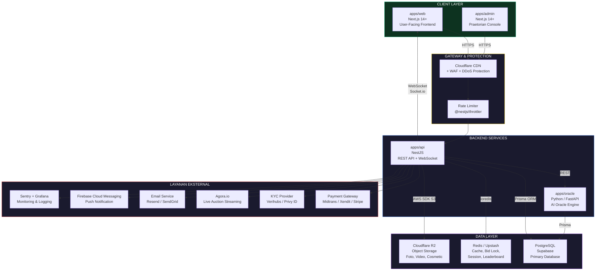
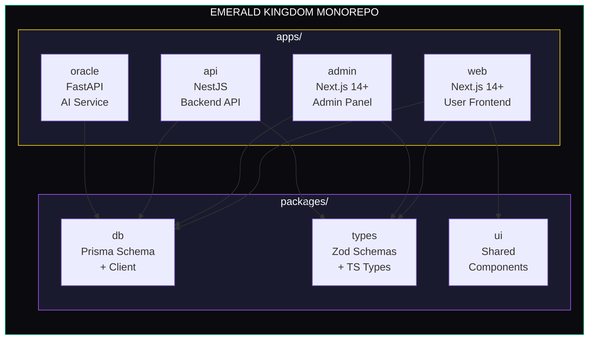
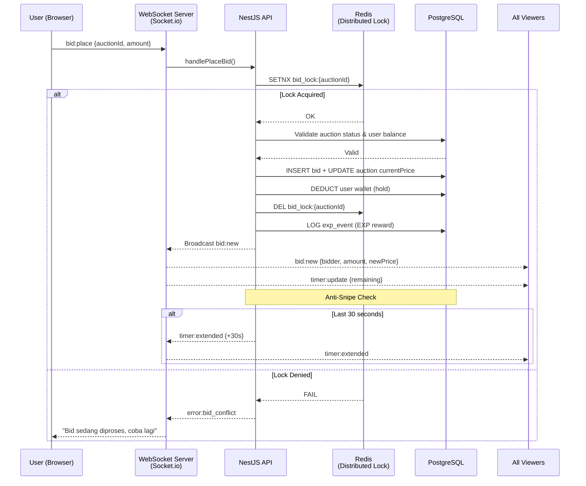
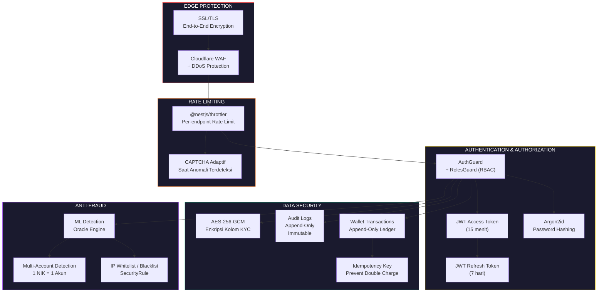
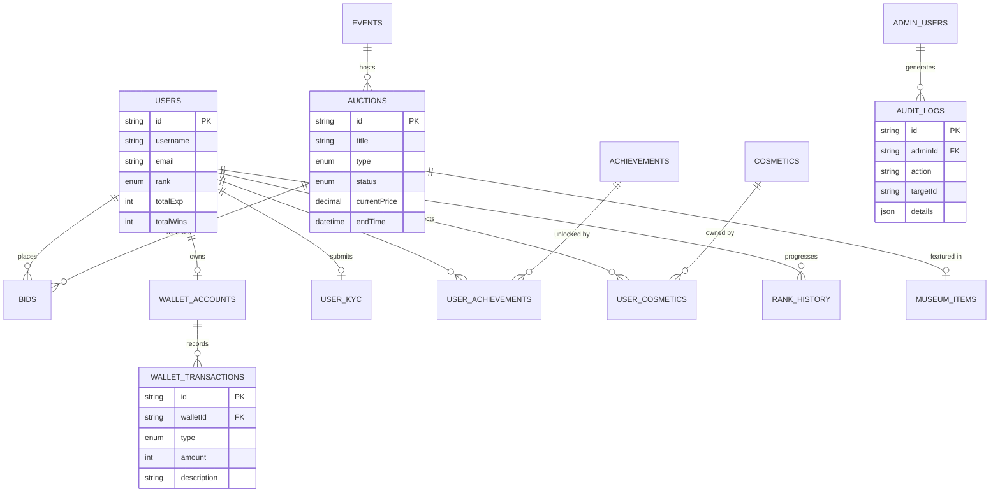

# Arsitektur Sistem Emerald Kingdom

> **Platform**: Emerald Kingdom — Luxury Gamified Auction Platform  
> **Tagline**: "Where Fortune Meets Glory."  
> **Arsitektur**: Monorepo (Turborepo) — Full-Stack TypeScript + Python AI

---

## 1. Arsitektur Tingkat Tinggi (High-Level Architecture)

### Penjelasan Komponen

| Layer | Komponen | Teknologi | Fungsi |
|-------|----------|-----------|--------|
| **Client** | `apps/web` | Next.js 14+, Tailwind, Zustand, TanStack Query | Antarmuka pengguna: homepage, lelang, profil, wallet, shop |
| **Client** | `apps/admin` | Next.js 14+, Vanilla CSS | Panel admin (Praetorian Console): kelola user, lelang, keuangan, konten |
| **Gateway** | Cloudflare | CDN, WAF, DDoS Protection | Perlindungan edge, caching aset statis, SSL termination |
| **Backend** | `apps/api` | NestJS, Socket.io, Prisma | API utama: auth, CRUD, WebSocket real-time, business logic |
| **Backend** | `apps/oracle` | Python, FastAPI | AI engine: fraud detection, rekomendasi, pricing intelligence |
| **Database** | PostgreSQL | Supabase (managed) | Data utama: users, auctions, bids, wallet, audit logs |
| **Cache** | Redis | Upstash (managed) | Session, bid lock (distributed), leaderboard sorted sets |
| **Storage** | Cloudflare R2 | S3-compatible | Foto barang, video, aset cosmetic, dokumen KYC |

---

## 2. Struktur Monorepo Turborepo

### Penjelasan Packages Shared

| Package | Fungsi | Dikonsumsi Oleh |
|---------|--------|-----------------|
| `packages/db` | Prisma schema tunggal untuk seluruh database. Semua app menggunakan client yang sama | web, admin, api, oracle |
| `packages/types` | Zod schemas dan TypeScript types yang dipakai bersama (contoh: `WS_EVENTS`, DTOs) | web, admin, api |
| `packages/ui` | Komponen UI yang di-share antara web dan admin (button, card, modal) | web, admin |

---

## 3. Alur Data Lelang Real-Time (Live Auction Flow)

### Penjelasan Flow

1. **User** mengirim bid melalui WebSocket (`bid:place`)
2. **Redis distributed lock** mencegah race condition (hanya 1 bid diproses per waktu per auction)
3. **Validasi** dilakukan: status lelang, saldo user, increment minimum
4. **Database** diupdate secara atomik: bid baru disimpan, harga terakhir diperbarui, saldo user di-hold
5. **Broadcast** ke semua viewer yang sedang menonton lelang tersebut
6. **Anti-snipe**: jika bid masuk di 30 detik terakhir, timer otomatis diperpanjang

---

## 4. Arsitektur Keamanan (Security Architecture)

### Lapisan Keamanan

| Lapisan | Komponen | Detail |
|---------|----------|--------|
| **Edge** | Cloudflare WAF + SSL | DDoS protection, TLS termination, geo-blocking |
| **Rate Limiting** | NestJS Throttler | 100 req/60s default, lebih ketat untuk endpoint sensitif |
| **Auth** | JWT + Argon2id | Access token 15 menit, refresh 7 hari, password hash Argon2id |
| **RBAC** | RolesGuard | 5 role admin: SUPER_ADMIN, AUCTION_MANAGER, KYC_OFFICER, CONTENT_MANAGER, SUPPORT_OFFICER |
| **Enkripsi** | AES-256-GCM | Data KYC (KTP, selfie) dienkripsi per-kolom di database |
| **Audit** | Append-Only Logs | Semua aksi admin dicatat dan tidak bisa dihapus/diubah |
| **Anti-Fraud** | Oracle Engine (AI) | Deteksi bid sniping, multi-akun, pola mencurigakan |

---

## 5. Tabel Database Kritis

---

> [!IMPORTANT]
> Diagram di atas menggambarkan arsitektur sistem **Emerald Kingdom** secara menyeluruh. Untuk keperluan presentasi Tugas Akhir, diagram-diagram ini bisa diekspor sebagai gambar dari preview Mermaid, atau di-screenshot langsung dari tampilan markdown ini.

> [!TIP]
> Jika kamu butuh gambar PNG/SVG terpisah dari salah satu diagram di atas untuk dimasukkan ke dokumen laporan, beri tahu saya diagram yang mana dan saya akan membuatnya sebagai file gambar tersendiri.
