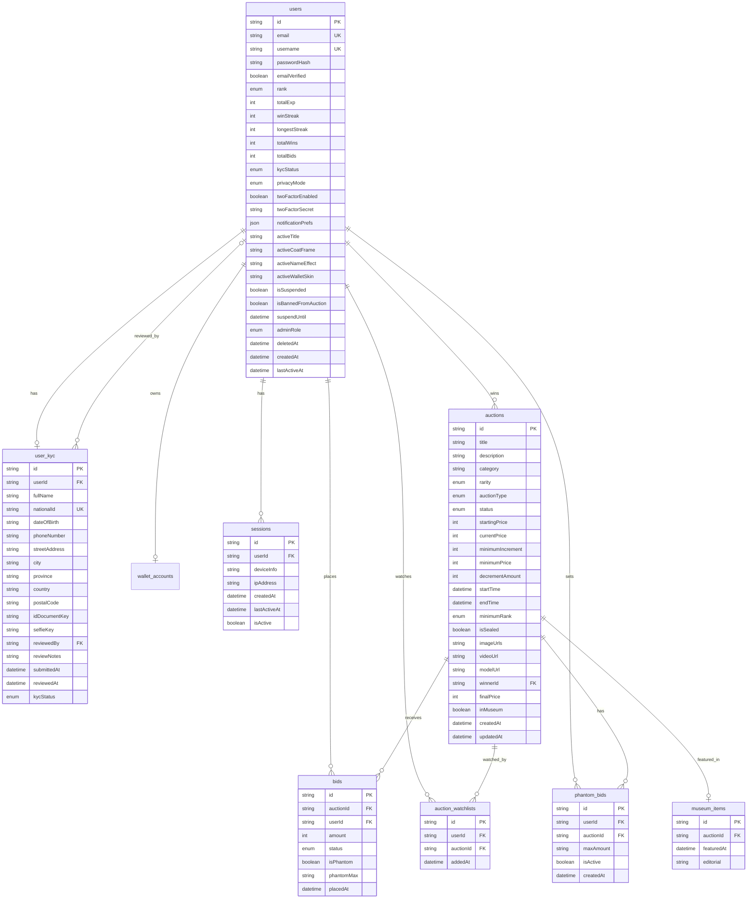
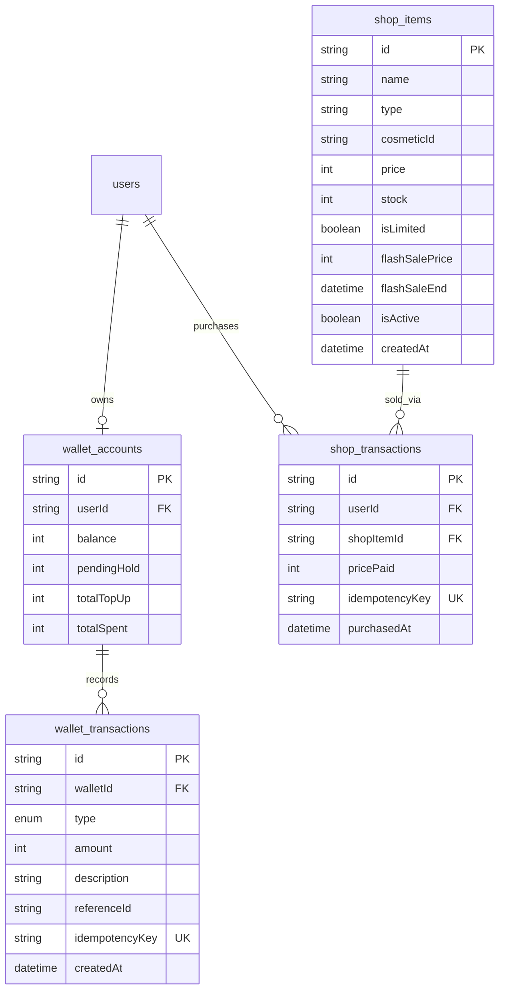
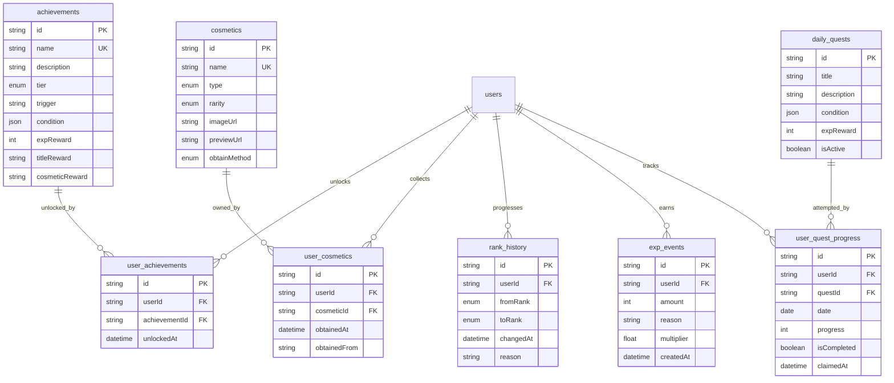
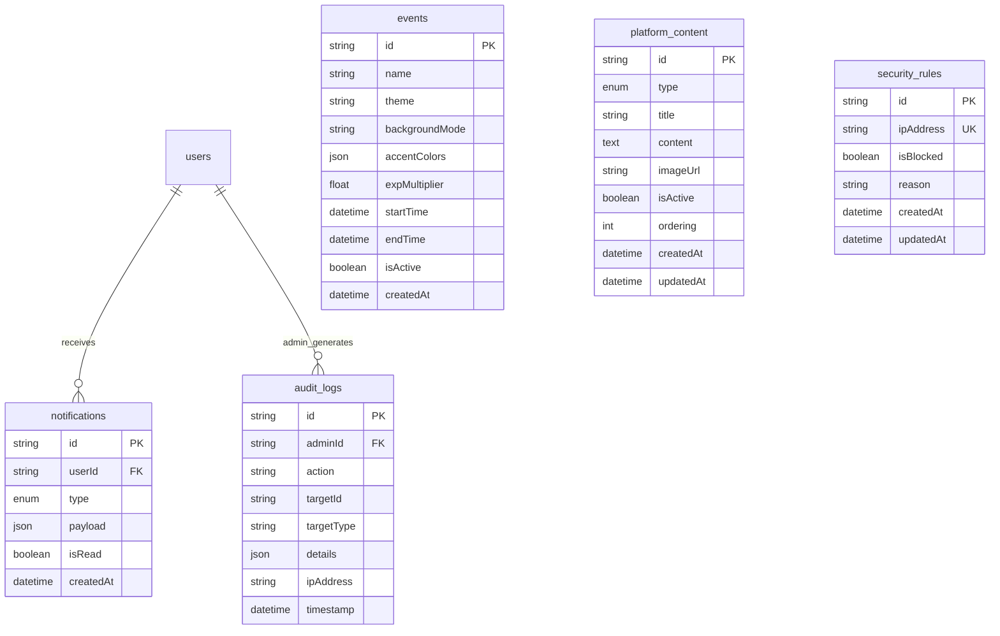

# Entity Relationship Diagram (ERD) — Emerald Kingdom

> **Database**: PostgreSQL (Supabase Managed)  
> **ORM**: Prisma  
> **Total Model**: 21 tabel + 16 enum  
> **Skema**: `packages/db/schema.prisma`

---

## 1. ERD Inti — Users, Auctions, Bids

Diagram ini menampilkan tabel-tabel utama platform: pengguna, lelang, penawaran, dan fitur terkait.

### Keterangan Atribut Khusus (ERD 1)

| Tabel | Kolom | Catatan |
|-------|-------|---------|
| `users` | `twoFactorSecret` | Nullable, ENCRYPTED |
| `users` | `adminRole` | Nullable, enum AdminRole |
| `users` | `deletedAt` | Nullable, soft delete |
| `user_kyc` | `fullName`, `nationalId`, `dateOfBirth`, `phoneNumber`, `streetAddress` | ENCRYPTED (AES-256-GCM) |
| `user_kyc` | `idDocumentKey`, `selfieKey` | Cloudflare R2 object key |
| `auctions` | `imageUrls` | Array of string (URL) |
| `auctions` | `minimumPrice`, `decrementAmount` | Nullable, untuk descending auction |
| `bids` | `phantomMax` | Nullable, ENCRYPTED |

---

## 2. ERD Keuangan & Shop

Diagram ini menampilkan sistem keuangan Crown Coin dan toko item.

> [!IMPORTANT]
> **`wallet_transactions` bersifat APPEND-ONLY.** Tidak boleh ada operasi UPDATE atau DELETE. Setiap transaksi bersifat immutable sebagai bukti audit keuangan.

### Tipe Transaksi Wallet (WalletTxType)

| Enum Value | Deskripsi |
|------------|-----------|
| `TOP_UP` | Pengisian saldo Crown Coin |
| `BID_HOLD` | Saldo ditahan saat memasang bid |
| `BID_RELEASE` | Saldo dikembalikan saat kalah bid |
| `BID_DEDUCT` | Saldo final dipotong saat menang |
| `CASHBACK` | Cashback dari platform |
| `SHOP_PURCHASE` | Pembelian di Royal Market |
| `REFUND` | Refund manual oleh admin |
| `BONUS` | Bonus event atau promosi |

---

## 3. ERD Progression — Achievements, Cosmetics, Rank, EXP, Quests

Diagram ini menampilkan sistem gamifikasi dan progression pengguna.

### Hierarki Rank — "The Noble Hierarchy"

| Level | Rank | Deskripsi |
|-------|------|-----------|
| 1 | CIVIS | Rank awal semua pengguna baru |
| 2 | MERCHANT | Pedagang pemula |
| 3 | KNIGHT | Kesatria yang aktif |
| 4 | BARON | Bangsawan rendah |
| 5 | VISCOUNT | Bangsawan menengah |
| 6 | EARL | Bangsawan senior |
| 7 | MARQUIS | Pejabat tinggi |
| 8 | DUKE | Penguasa regional |
| 9 | SOVEREIGN | Calon penguasa tertinggi |
| 10 | EMPEROR | Rank tertinggi, eksklusif |

### Rarity Cosmetic

| Rarity | Sumber Distribusi |
|--------|-------------------|
| COMMON | Shop, Quest |
| UNCOMMON | Shop, Achievement |
| RARE | Achievement, Event |
| EPIC | Event, Rank Reward |
| LEGENDARY | Limited Event Only |
| MYTHIC | 1 kali distribusi selamanya |

---

## 4. ERD Platform — Events, Notifications, Audit, Content, Security

Diagram ini menampilkan tabel pendukung operasional platform.

> [!IMPORTANT]
> **`audit_logs` bersifat APPEND-ONLY.** Tidak boleh ada operasi UPDATE atau DELETE. Ini adalah sumber kebenaran untuk investigasi seluruh aksi admin.

### Tipe Notifikasi (NotifType)

| Enum Value | Kapan Dikirim |
|------------|---------------|
| `OUTBID` | Saat bid user di-outbid oleh orang lain |
| `AUCTION_ENDING_SOON` | 5 menit sebelum lelang berakhir |
| `YOU_WON` | Saat user memenangkan lelang |
| `LIVE_AUCTION_START` | Saat live auction yang di-watchlist dimulai |
| `RANK_UP` | Saat user naik rank |
| `NEW_ACHIEVEMENT` | Saat achievement baru di-unlock |
| `EVENT_STARTING` | Saat event seasonal dimulai |
| `CASHBACK_RECEIVED` | Saat cashback masuk ke wallet |
| `KYC_STATUS` | Saat status KYC berubah |
| `SECURITY_ALERT` | Saat terdeteksi login mencurigakan |
| `EMPEROR_ASCENSION` | Broadcast global saat Emperor pertama muncul |

---

## 5. Ringkasan Seluruh Tabel

| No | Tabel | Deskripsi | Aturan Khusus |
|----|-------|-----------|---------------|
| 1 | `users` | Data utama pengguna | Soft delete via `deletedAt` |
| 2 | `user_kyc` | Data verifikasi identitas | 6 kolom ENCRYPTED (AES-256-GCM) |
| 3 | `auctions` | Data setiap lelang | Index pada status, type, time |
| 4 | `bids` | Setiap penawaran yang masuk | Composite index `[auctionId, amount]` |
| 5 | `wallet_accounts` | Saldo Crown Coin per user | 1:1 dengan users |
| 6 | `wallet_transactions` | Ledger keuangan | **APPEND-ONLY, idempotencyKey** |
| 7 | `sessions` | Sesi login aktif | Untuk revoke session |
| 8 | `achievements` | Definisi achievement | Trigger + JSON condition |
| 9 | `user_achievements` | Junction user-achievement | Unique `[userId, achievementId]` |
| 10 | `cosmetics` | Definisi cosmetic | Rarity system 6 tier |
| 11 | `user_cosmetics` | Koleksi cosmetic user | Unique `[userId, cosmeticId]` |
| 12 | `rank_history` | Log naik/turun rank | Audit trail progression |
| 13 | `exp_events` | Log perolehan EXP | Supports event multiplier |
| 14 | `events` | Event seasonal | Dynamic theme + accent colors |
| 15 | `notifications` | Notifikasi per user | 11 tipe notifikasi |
| 16 | `audit_logs` | Aksi admin | **APPEND-ONLY, immutable** |
| 17 | `shop_items` | Item di Royal Market | Flash sale support |
| 18 | `shop_transactions` | Riwayat pembelian shop | idempotencyKey |
| 19 | `daily_quests` | Definisi quest harian | JSON condition |
| 20 | `user_quest_progress` | Progress quest per hari | Unique `[userId, questId, date]` |
| 21 | `museum_items` | Item dikurasi ke museum | 1:1 dengan auctions |
| 22 | `auction_watchlists` | User watch lelang | Unique `[userId, auctionId]` |
| 23 | `phantom_bids` | Phantom bid otomatis | maxAmount ENCRYPTED |
| 24 | `platform_content` | Banner, News, FAQ | Ordered content management |
| 25 | `security_rules` | IP Whitelist/Blacklist | Unique ipAddress |

---

## 6. Referensi Enum Lengkap

| Enum | Values | Digunakan Pada |
|------|--------|----------------|
| `Rank` | CIVIS, MERCHANT, KNIGHT, BARON, VISCOUNT, EARL, MARQUIS, DUKE, SOVEREIGN, EMPEROR | users, rank_history, auctions |
| `ItemRarity` | COMMON, UNCOMMON, RARE, EPIC, LEGENDARY, TRANSCENDENT | auctions |
| `CosmeticRarity` | COMMON, UNCOMMON, RARE, EPIC, LEGENDARY, MYTHIC | cosmetics |
| `CosmeticType` | FRAME, BANNER, NAME_EFFECT, WALLET_SKIN, CHAT_EFFECT | cosmetics |
| `ObtainMethod` | SHOP, ACHIEVEMENT, RANK, EVENT | cosmetics |
| `AuctionType` | STANDARD, SCHEDULED, LIVE, RANK_EXCL, SEALED_CHEST, DESCENDING | auctions |
| `AuctionStatus` | DRAFT, UPCOMING, ACTIVE, ENDING, ENDED, CANCELLED | auctions |
| `BidStatus` | ACTIVE, OUTBID, WON, REFUNDED | bids |
| `KYCStatus` | NONE, PENDING, APPROVED, REJECTED | users, user_kyc |
| `WalletTxType` | TOP_UP, BID_HOLD, BID_RELEASE, BID_DEDUCT, CASHBACK, SHOP_PURCHASE, REFUND, BONUS | wallet_transactions |
| `NotifType` | 11 tipe notifikasi | notifications |
| `PrivacyMode` | PUBLIC, ANONYMOUS, SHADOW | users |
| `AchievementTier` | COMMON, RARE, EPIC | achievements |
| `AdminRole` | SUPER_ADMIN, AUCTION_MANAGER, KYC_OFFICER, CONTENT_MANAGER, SUPPORT_OFFICER | users |
| `ContentType` | BANNER, NEWS, FAQ | platform_content |
